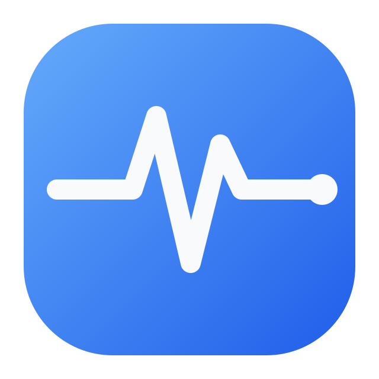
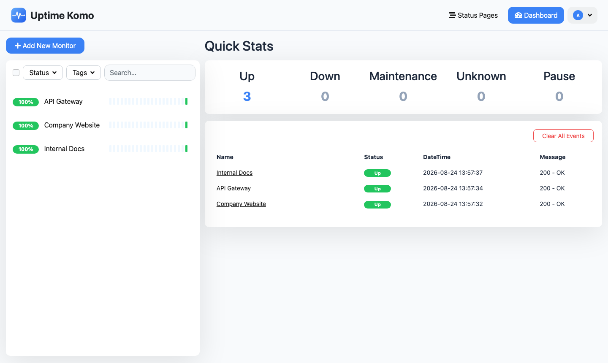
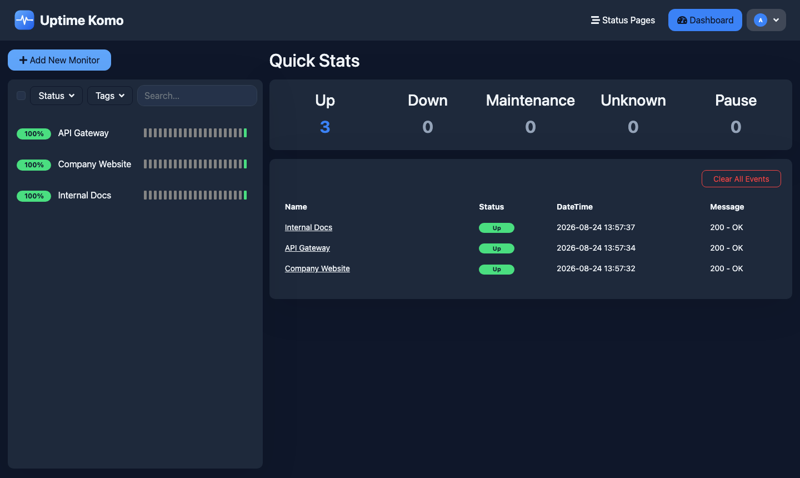
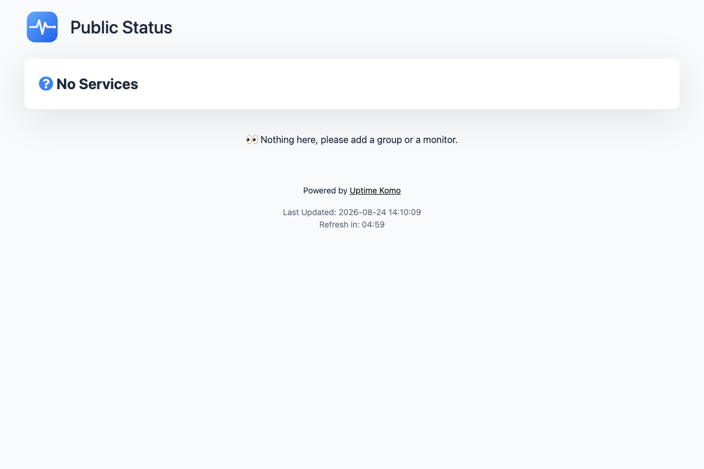

<div align="center" width="100%">
    
</div>

# Uptime Komo

Uptime Komo is an easy-to-use self-hosted monitoring tool, customized for internal use. It started as an internal fork of [Uptime Kuma](https://github.com/louislam/uptime-kuma), but has since been given its own identity — a fresh logo and icon set, a distinct blue color system with full dark mode support, and a softer, less "pill-heavy" shape language across buttons, cards, and the heartbeat bar — plus a trimmed-down set of notification providers for internal use.

## ⭐ Features

- Monitoring uptime for HTTP(s) / TCP / HTTP(s) Keyword / HTTP(s) Json Query / Websocket / Ping / DNS Record / Push / Steam Game Server / Docker Containers
- Fancy, Reactive, Fast UI/UX
- Notifications via Telegram, Discord, Slack, Microsoft Teams, Ntfy, SendGrid, Webhook, and WhatsApp (via Whapi, WAHA, OpenWA, or Onesender)
- 20-second intervals
- Multiple status pages
- Map status pages to specific domains
- Ping chart
- Certificate info
- Proxy support
- 2FA support
- Semi-automatic monitor registration by scanning a Kubernetes namespace (see below)

## ☸️ Semi-Automatic Monitor Registration (Kubernetes)

Instead of adding monitors one by one, you can point Uptime Komo at a Kubernetes
namespace and have it discover and register monitors for you: click **Scan
Kubernetes Namespace** on the dashboard, enter a namespace, and every Service in
it is automatically registered as a monitor (re-scanning skips services that are
already registered). Each Service port is checked over the in-cluster DNS name
(`<service>.<namespace>.svc.cluster.local`) and classified automatically — ports
named/numbered like HTTP (e.g. `http`, `web`, `80`, `8080`, `443`) become HTTP(S)
monitors, everything else becomes a plain TCP port check.

This requires Uptime Komo to be **running inside the target Kubernetes
cluster**, using its Pod's ServiceAccount to talk to the API server — it does
not support scanning a remote/external cluster via kubeconfig. The
ServiceAccount needs read access to `services`; apply the example RBAC in
[`kubernetes/rbac.yaml`](kubernetes/rbac.yaml) (adjust the namespace/name to
match your deployment) and make sure that ServiceAccount is set on Uptime
Komo's own Pod spec.

## 🔧 How to Install

### 🐳 Docker Compose

```bash
docker compose up -d --build
```

Uptime Komo is now running on all network interfaces (e.g. http://localhost:3001 or http://your-ip:3001).

> [!WARNING]
> File Systems like **NFS** (Network File System) are **NOT** supported. Please map to a local directory or volume.

### 💪🏻 Non-Docker

Requirements:

- Platform
  - ✅ Major Linux distros such as Debian, Ubuntu, Fedora and ArchLinux etc.
  - ✅ Windows 10 (x64), Windows Server 2012 R2 (x64) or higher
  - ❌ FreeBSD / OpenBSD / NetBSD
  - ❌ Replit / Heroku
- [Node.js](https://nodejs.org/en/download/) >= 20.4
- [Git](https://git-scm.com/downloads)
- [pm2](https://pm2.keymetrics.io/) - For running Uptime Komo in the background

```bash
npm run setup

# Option 1. Try it
node server/server.js

# (Recommended) Option 2. Run in the background using PM2
# Install PM2 if you don't have it:
npm install pm2 -g && pm2 install pm2-logrotate

# Start Server
pm2 start server/server.js --name uptime-komo
```

Uptime Komo is now running on all network interfaces (e.g. http://localhost:3001 or http://your-ip:3001).

More useful PM2 Commands

```bash
# If you want to see the current console output
pm2 monit

# If you want to add it to startup
pm2 startup && pm2 save
```

## 🖼 Screenshots

Dashboard (Light Mode):



Dashboard (Dark Mode):



Public Status Page:


